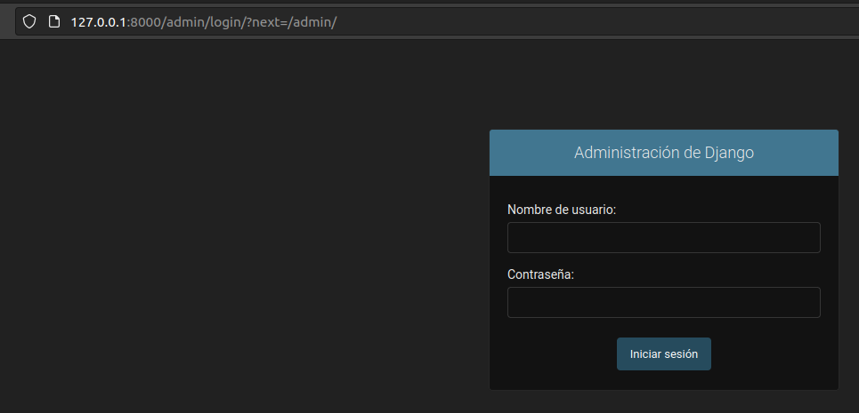
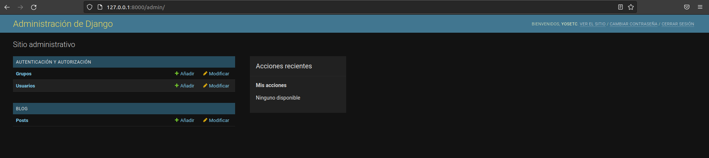
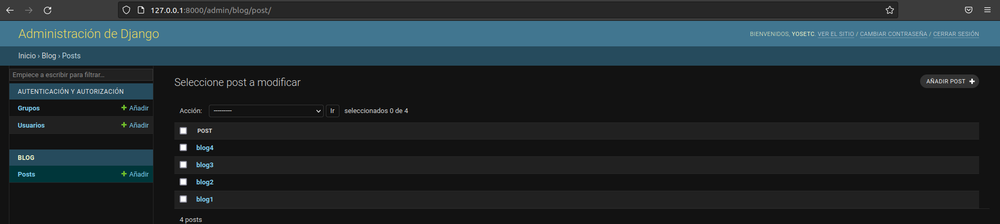
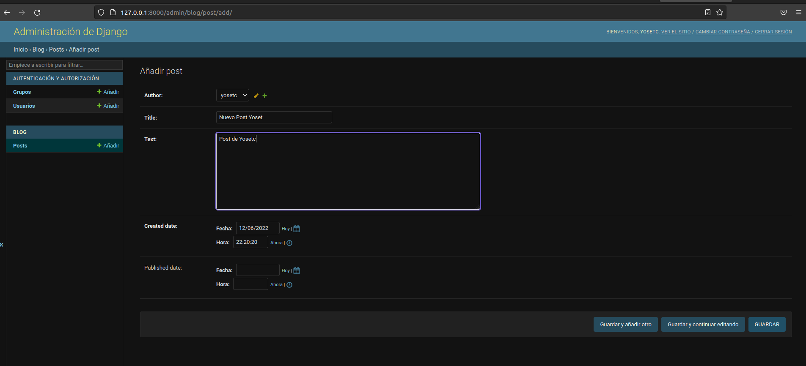
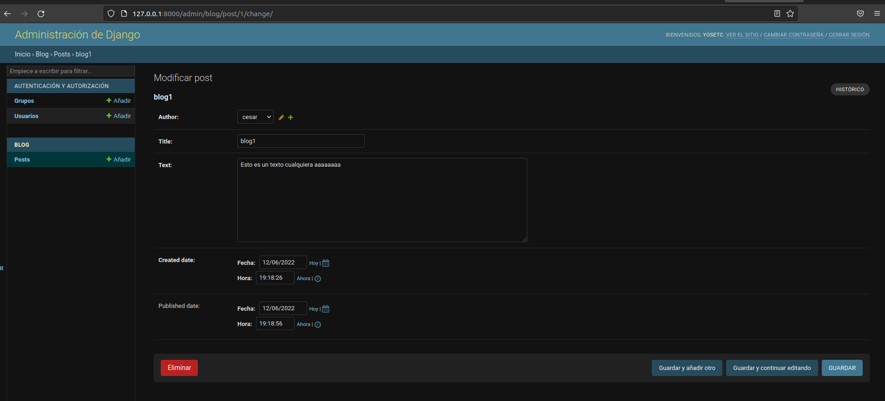
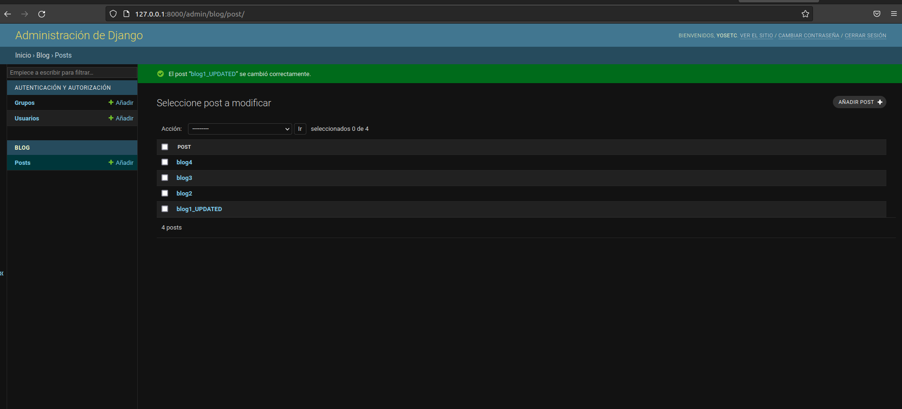
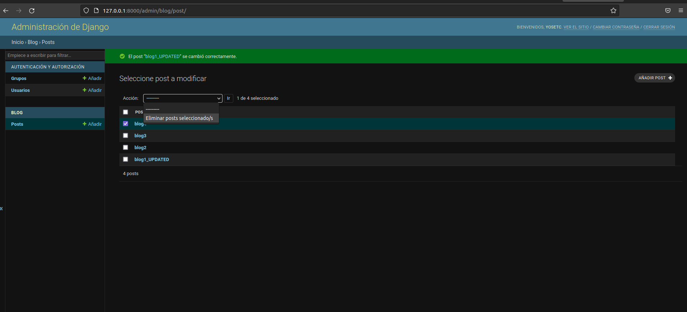
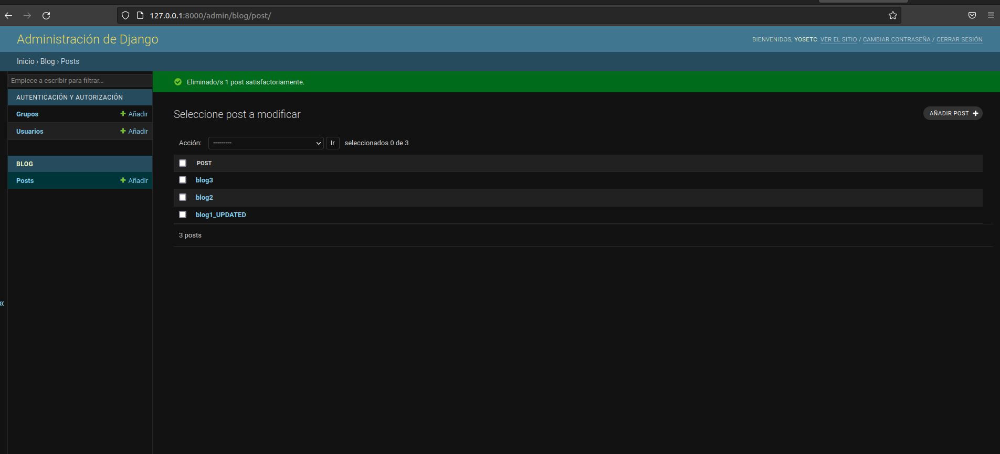

#PS_LABS
# INFORME DE LABORATORIO 04
<div align="center">
<table>
    <theader>
        <tr>
                <td style="width:50%; height:auto"></td>
            <th>
                <span style="font-weight:bold;">UNIVERSIDAD NACIONAL DE SAN AUGUSTIN</span><br />
                <span style="font-weight:bold;">FACULTAD DE INGENIERÍA DE PRODUCCIÓN Y SERVICIOS</span><br />
                <span style="font-weight:bold;">ESCUELA PROFESIONAL DE INGENIERÍA DE SISTEMAS</span>
            </th>
               <td></td>
                  </tr>
    </theader>
    <tbody>
        <tr><td colspan="3"><span style="font-weight:bold;">Formato</span>: Guía del Estudiante / Talleres / Centros de Simulación</td></tr>
        <tr><td><span style="font-weight:bold;">Aprobación</span>:  2022/03/01</td><td><span style="font-weight:bold;">Código</span>: GUIA-PRLD-001</td><td><span style="font-weight:bold;">Página</span>: 1</td></tr>
    </tbody>
</table>
</div>

<div align="center">
<span style="font-weight:bold;">GUÍA DEL ESTUDIANTE</span><br />
<span>(formato del estudiante)</span>
</div>


<table>
<theader>
<tr><th colspan="6">INFORMACIÓN BÁSICA</th></tr>
</theader>
<tbody>
<tr><td>ASIGNATURA:</td><td colspan="5">Programación de Sistemas</td></tr>
<tr><td>TÍTULO DE LA PRÁCTICA:</td><td colspan="5">Punteros</td></tr>
<tr>
<td>NÚMERO DE PRÁCTICA:</td><td>06</td><td>AÑO LECTIVO:</td><td>2022 A</td><td>NRO. SEMESTRE:</td><td>III</td>
</tr>
<tr>
<tr> <td>Tipo de Practica</td>
    <td>Grupal</td><td>X</td>
        <td>Individual</td><td>Maximo de estudiantes</td><td></td>
    </td> 
</tr>

<td>FECHA INICIO::</td><td>Jun-2022</td><td>FECHA FIN:</td><td>11-Jun-2022</td><td>DURACIÓN:</td><td>04 horas</td>
</tr>
<tr><td colspan="6">INTEGRANTES:
<ul>
<li>Cozco Mauri Yoset -------------------- ycozco@unsa.edu.pe</li>
<li>Garay Bedregal César Alejandro -------- cgarayb@unsa.edu.pe</li>
<li>Sulla Quispe Vladimir ----------------- vsullaq@unsa.edu.pe</li>
</ul>
</td>
</<tr>
<tr><td colspan="6">DOCENTES:
<ul>
<li> Edson Francisco Luque Mamani(eluquem@unsa.edu.pe)</li>
</ul>
</td>
</<tr>
</tdbody>
</table>


<table>
<theader>
<tr><th colspan="6">SOLUCIÓN Y RESULTADOS</th></tr>
</theader>
<tbody>
</tr>
<tr><td colspan="6">
<tr>

## I. SOLUCIÓN DE EJERCICIOS PROPUESTOS:
<br>
<tr>
- Crea un blog sencillo en un entorno virtual utilizando la guía: https://tutorial.djangogirls.org/es/django_start_project/. 
- Especificar paso a paso la creación del blog en su informe.

## Entorno Virtual y Configuracion

- Lo primero que debemos tener en cuenta es activar nuestro entorno virtual de trabajo, para poder instalar librerias sin afectar a otros proyectos.

```bash
ncnc@ncnc:~/Desktop/test$ source ./bin/activate
(test) ncnc@ncnc:~/Desktop/test$
```
- Lo siguiente es instalar Django  par alo cual ejecutamos 

```bash
(test_2) ncnc@ncnc: pip install Django
```
- Instalando Django y dando como resultado:
```bash
(test_2) ncnc@ncnc:~/Desktop/test_2$ pip install Django
Collecting Django
  Using cached Django-4.0.5-py3-none-any.whl (8.0 MB)
Collecting asgiref<4,>=3.4.1
  Using cached asgiref-3.5.2-py3-none-any.whl (22 kB)
Collecting sqlparse>=0.2.2
  Using cached sqlparse-0.4.2-py3-none-any.whl (42 kB)
Installing collected packages: sqlparse, asgiref, Django
Successfully installed Django-4.0.5 asgiref-3.5.2 sqlparse-0.4.2

```

- Tenemos el siguiente resultado dado que previamente ya se ha instalado Djando en otra, carpeta
  Usa los archivos que tiene en Cache, caso contrario deberia descargar.

- Una ves instalado Django, debemos iniciar nuestro proyecto de la siguiente manera

```bash
django-admin startproject blog

```
- Tendriamos un resultado:

```bash
blog
├── manage.py
└── blog
    ├── asgi.py
    ├── __init__.py
    ├── settings.py
    ├── urls.py
    └── wsgi.py
```
lo siguiente es crear el modelo de nuestro blog, este esta ubicado en la carpeta ```blog/models.py```

```python
from django.conf import settings
from django.db import models
from django.utils import timezone


class Post(models.Model):
    author = models.ForeignKey(settings.AUTH_USER_MODEL, on_delete=models.CASCADE)
    title = models.CharField(max_length=200)
    text = models.TextField()
    created_date = models.DateTimeField(
            default=timezone.now)
    published_date = models.DateTimeField(
            blank=True, null=True)

    def publish(self):
        self.published_date = timezone.now()
        self.save()

    def __str__(self):
        return self.title
```
- como podemos observar el modelo de Post tiene los siguientes atributos:
    -  author: es una clave foranea que hace referencia a la tabla de usuarios
    -  title: es un atributo de tipo cadena de caracteres con una longitud maxima de 200 caracteres
    -  text: es un atributo de tipo cadena de caracteres
    -  created_date: es un atributo de tipo fecha y hora
    -  published_date: es un atributo de tipo fecha y hora
- Despues de esto tenemos que registrar nuestro modelo dentro de admin.py que se ubica en ```blog/admin.py```

```python
from django.contrib import admin
# Register your models here.
from .models import Post

admin.site.register(Post)
```
- Deberia quedar asi nuestro archivo ```admin.py```
- El siguiente paso es agregar como una aplicacion instalada en el archivo ```mysite/settings.py```

```python
# Application definition

INSTALLED_APPS = [
    'django.contrib.admin',
    'django.contrib.auth',
    'django.contrib.contenttypes',
    'django.contrib.sessions',
    'django.contrib.messages',
    'django.contrib.staticfiles',
    'blog.apps.BlogConfig',
]
```
- Para poder evitar errores es necesario verificar tener el archivo ```blog/apps.py```

```python
from django.apps import AppConfig

class BlogConfig(AppConfig):
    default_auto_field = 'django.db.models.BigAutoField'
    name = 'blog'
```
- Verificando que nuestro archivo este asi. 
- Ahora es hora de hacer el migrate en nuestro proyecto.
- En nuestro caso deberiamos hacerlo desde el directorio ```web2_lab05``` donde tambien se encuentra el archivo ```manage.py```.

```bash
python manage.py migrate
Applying sessions.0001_initial... OK 
```
- Realizamos la migracion, dandonos la ultima linea como la mostrada. 
- Para el manejo de nuestra aplicacion, es necesario tener un SuperUsuario, ejecutando el siguiente codigo

```bash
python manage.py createsuperuser
```

- En este caso, debemos ingresar los siguientes datos:

```bash
(test) ncnc@ncnc:~/Desktop/test/web2_lab05$ python manage.py createsuperuser
Nombre de usuario (leave blank to use 'ncnc'): yosetc
Dirección de correo electrónico: ycozco1@unsa.edu.pe
Password: 
Password (again): 
Esta contraseña es demasiado corta. Debe contener al menos 8 caracteres.
Esta contraseña es demasiado común.
Esta contraseña es completamente numérica.
Bypass password validation and create user anyway? [y/N]: y
Superuser created successfully.
```
- A continuacion realizaremos la migracion, de la forma:
- Recordemos que seguimos en la ruta ```web2_lab05```donde se encuentra el archivo ```manage.py```.

```bash
python manage.py makemigrations blog
python manage.py migrate
```
- Ejecutamos el servidor para poder visualizar nuestros avances y resultados:

```bash
python manage.py runserver

```
```bash
(test) ncnc@ncnc:~/Desktop/test/web2_lab05$ python manage.py runserver
Watching for file changes with StatReloader
Performing system checks...

System check identified no issues (0 silenced).
June 12, 2022 - 22:00:22
Django version 4.0.5, using settings 'mysite.settings'
Starting development server at http://127.0.0.1:8000/
Quit the server with CONTROL-C.

```
- Podemos acceder al panel de administracion de nuestro proyecto en la direccion: - http://127.0.0.1:8000/admin

- Podemos ver el inicio de sesion, donde debemos iniciar con los datos de nuestro superusuario:

- Al iniciar sesion nos dirige al panel de administracion:

- En el panel de administracion, nos dirijimos donde el modelo de nuestro blog (posts)

- En este panel podemos crear nuevos posts de la forma 

- Damos click sobre algun elemento previamente creado, para poder ver mas detalles, tenemos la opcion de editar todas las casillas

- En la opcion Editar, podemos editar el post que deseemos.

- En la opcion Eliminar, podemos eliminar el post que deseemos.


</tr>

<tr><td colspan="6">II. SOLUCIÓN DE CUESTIONARIO: <br>
- ¿Cuál es un estándar de codificación para Python? Ejemplo: Para PHP en el proyecto Pear https://pear.php.net/manual/en/standards.php<br>
Asi como en PHP se usa Pear python tiene a PEP 8 >https://peps.python.org/pep-0008/
    
- ¿Qué diferencias existen entre EasyInstall, pip, y PyPM?<br>
Los tres son instaladores, compiladores y administradores de paquetes de python las diferencias radican en
PyPM no es gratuito y solo se usa con ActiveState ActivePython
En EasyInstall si se interrumpe por alguna razón la instalacion se dejaron algunos rastros, con pip no ocurre esto
Pip no instala paquetes binarios
EasyInstall no actualiza todos los paquetes ni los lista por completo
EasyInstall busca en el PythonPackageIndex(PyPi) los paquetes deseados
EasyInstall está inspirado en rubygems y esta basado en el formato PythonEggs
PyPM esta inspirado en el administrador de paquetes de perl
PyPM utiliza colecciones de paquetes precompilados llamados “PyPM repositories”

- En un proyecto Django que se debe ignorar para usar git. Vea: https://github.com/django/django/blob/main/.gitignore. ¿Qué otros tipos de archivos se deberían agregar a este archivo?<br>
Aparte de los indicados en la pagina se deberian agregar
    
```
# Byte-compiled / optimized / DLL files
*$py.class

# C extensions
*.so

# Distribution / packaging
.Python
develop-eggs/
downloads/
eggs/
.eggs/
lib/
lib64/
parts/
sdist/
var/
wheels/
.installed.cfg
*.egg

# PyInstaller
#  Usually these files are written by a python script from a template
#  before PyInstaller builds the exe, so as to inject date/other infos into it.
*.manifest
*.spec

# Installer logs
pip-log.txt
pip-delete-this-directory.txt

# Unit test / coverage reports
htmlcov/
.coverage
.coverage.*
.cache
nosetests.xml
coverage.xml
*.cover
.hypothesis/
.pytest_cache/

# Translations
*.mo

# Django stuff:
*.log
local_settings.py
db.sqlite3

# Flask stuff:
instance/
.webassets-cache

# Scrapy stuff:
.scrapy

# PyBuilder
target/

# Jupyter Notebook
.ipynb_checkpoints

# pyenv
.python-version

# celery beat schedule file
celerybeat-schedule

# SageMath parsed files
*.sage.py

# Environments
.env
.venv
env/
venv/
ENV/
env.bak/
venv.bak/

# Spyder project settings
.spyderproject
.spyproject

# Rope project settings
.ropeproject

# mkdocs documentation
/site

# mypy
.mypy_cache/

# Exclude collected Django static files
static_collected

# Exclude machine-specific vs code settings
.vscode/settings.json
    
``` 
y aparte algunos otros que se crean si se usa un editor de codigo
visualStudio
    
``` 
    
# Exclude machine-specific vs code settings
.vscode/* 
!.vscode/settings.json 
!.vscode/tasks.json 
!.vscode/launch.json 
!.vscode/extensions.json 
.history
``` 
o Sublime Text
    
``` 
*.tmlanguage.cache 
*.tmPreferences.cache 
*.stTheme.cache 
*.sublime-workspace 
*.sublime-project 
``` 
    
- Utilice python manage.py shell para agregar objetos. ¿Qué archivos se modificaron al agregar más objetos?<br>
El shell de django ejecuta un intérprete que te permite modificar recursos ya sea de la base de datos o de cualquier otro recurso usado en el proyecto django

</tr>
</tr>
<tr><td colspan="6">III. CONCLUSIONES:

</tr>

</tdbody>
</table>


<table>
<theader>
<tr><th colspan="6">RETROALIMENTACIÓN GENERAL</th></tr>
</theader>
<tbody>
</tr>
<tr><td colspan="6">
<ul>
<li><a </a></li>
<li><a </a></li>
<li><a </a></li>
</ul>
</td>
</<tr>
</tdbody>
</table>


<table>
<theader>
<tr><th colspan="6">REFERENCIAS BIBLIOGRÁFICAS</th></tr>
</theader>
<tbody>
</tr>
<tr><td colspan="6">
<ul>
<li>https://peps.python.org/pep-0008</li>
<li>https://setuptools.pypa.io/en/latest/deprecated/easy_install.html#:~:text=Easy%20Install%20is%20a%20python,via%20the%20distutils%20mailing%20list.</li>
<li>https://en.wikipedia.org/wiki/Setuptools</li>
<li>https://pypi.org/project/pip/</li>
<li>https://en.wikipedia.org/wiki/Python_Package_Manager</li>
<li>https://www.iteramos.com/pregunta/5350/por-que-usar-pip-sobre-easy_install</li>
<li>https://svn.python.org/projects/sandbox/trunk/setuptools/doc/formats.txt</li>
<li>https://github.com/microsoft/python-sample-vscode-django-tutorial/blob/master/.gitignore</li>
<li>https://djangowaves.com/tips-tricks/gitignore-for-a-django-project/</li>
<li>https://stackoverflow.com/questions/60623885/in-command-line-what-does-python-file-py-shell-do</li>
<li>https://www.iteramos.com/pregunta/5350/por-que-usar-pip-sobre-easy_install</li>
<li>https://svn.python.org/projects/sandbox/trunk/setuptools/doc/formats.txt</li>
<li>https://djangowaves.com/tips-tricks/gitignore-for-a-django-project/</li>
<li>https://stackoverflow.com/questions/60623885/in-command-line-what-does-python-file-py-shell-do</li>

</ul>
</td>
</<tr>
</tdbody>
</table>


